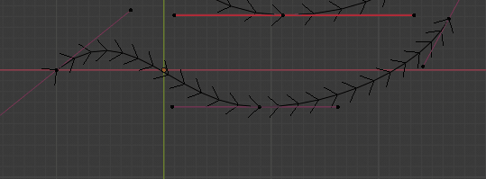

# Curve Edit Tools

Curve Edit Tools is a Blender Addon which currently consists of the single operatore `insert_bezier_point`.

## **Insert Bezier Point**
In edit mode of a curve, press **I** to insert a point.

## Installation
Download *curve_edit_tools.zip* from [Release v0.9](https://github.com/LeanderSilur/Blender-Tools/releases/tag/curve_edit_tools). Install the zip via the Blender Preferences > Addon.

### v0.9
- Updated for Blender 2.8x by [Andrew Yang](https://github.com/AndrewYY)
- Option Box after

### TODO
- Correct Depth Picking for Beziers with the numpy minimal Solver, replacing the brute force picking.
- Vertex Slide Operator
- Anti-Aliasing in 2.8x