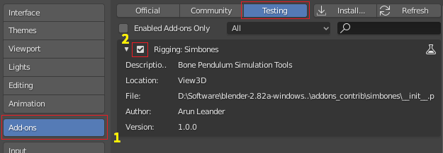
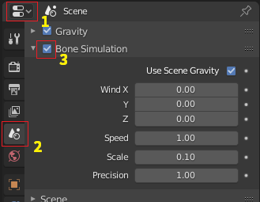
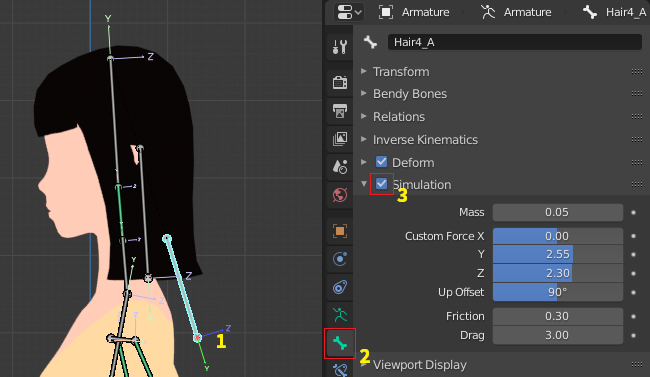
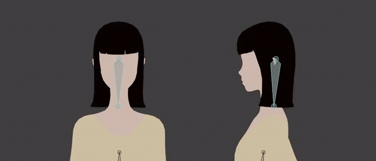
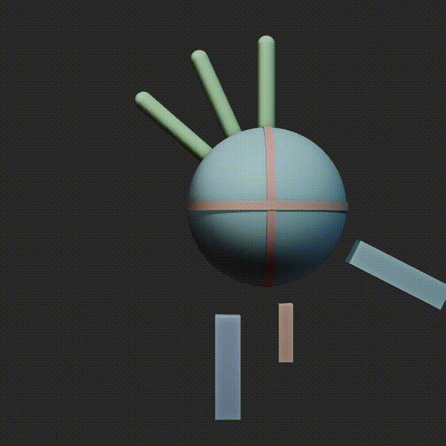

# Simbones
*Simbones* is a Blender Addon, which can simulate a pendulum-like motion of bones in an animated rig.

Simulating secondary movement with bones (instead of cloth, softbodies or others) is useful for exporting animations to game engines or other media which only supports skeletal deformations.

## Installation

Like any Blender Addon through the Blender Preferences.  
The addon is located in the Testing section.

## Usage

1. Enable *Bone Simulation* in the scene settings. You can change the simulation time and space scale here.  

2. Select a pose bone and enable *Simulation* in the Pose Bone Properties.  

3. Go into pose mode and choose the menu item Simbones > Bake to bake the movement to keyframes.

## Features
Name | Description
--- | ---
Length | Different bone length will taken into account. Longer bones swing with a slower frequency.
Friction | Mechanical friction in world space. A high mechanical friction will result in less movement.
Drag | Air friction in world space. A high air friction will drag the end of the bones. This is especially useful if the bone moves through the scene, as in hair strands following the character.
Chaining | Chained simulated bones don't affect each other. However, they are calculated from parent to child in a hierarchial order. This makes using bone chaines possible.
Custom Force | Using the tools from the menu, a custom force can be setup quickly. The custom force can counteract gravity and let simulated bones maintain their initial orientation (rest pose) if there is no movement or parent orientation. This is a common problem with simulation, which usually cause hair or cloth to move and jiggle once the simulation commences and gravity starts to affect the elements. The custom force allows us to setup the bones and geometry in rest pose with gravity applied.

## Example Results

